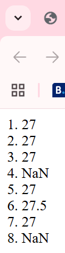
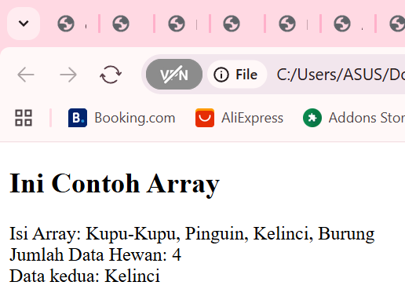
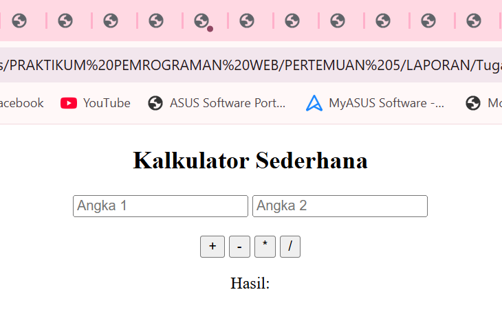

# ANALISIS 
**2. JavaScript pada file HTML**

**a. Menggunakan tag script**
 ```html
        <HTML>
        <HEAD>
            <TITLE>contoh JavaScript</TITLE>
            <script language="JavaScript">
            document.write("Program JavaSript Aku di kepala");
            </script>
        </HEAD>
        <BODY>
            <script language="JavaScript">
            document.write("Program JavaSript Aku di body");
            </script>
        </BODY>
        </HTML>
```


Kode HTML tersebut menampilkan tulisan dari JavaScript menggunakan document.write(). Pada bagian head, JavaScript menuliskan teks “Program JavaSript Aku di kepala”, lalu pada bagian body, JavaScript kembali menuliskan teks “Program JavaSript Aku di body”. Karena keduanya menggunakan document.write(), hasil akhirnya di browser adalah kedua teks itu muncul berurutan sesuai urutan script dituliskan dalam file HTML.

**b. Menggunakan file eksternal**
```html
     <SCRIPT LANGUAGE=Javascript SRC=url/file.js> </SCRIPT>
```  
Baris ini digunakan untuk memanggil file JavaScript eksternal. Artinya, Anda bisa menaruh kode JavaScript di luar file HTML (misalnya file.js), lalu menyambungkannya ke HTML menggunakan atribut SRC. Dengan begitu, kode lebih rapi, terpisah, dan mudah dikelola.

**c. Event Tertentu**
 ```html
        <!DOCTYPE html>
        <html>
            <head>
             <title>Belajar Javascript : Mengenal Event Pada Javascript</title>
            </head>
            <body>
                <h1>Mengenal Event Pada Javascript</h1>
                <h2>Perograman WEB Event one click</h2>
                <button onclick="tampilkan_nama()">Klik di sini</button>
                <div id="hasil"></div>
                <script>
                    function tampilkan_nama() {
                    document.getElementById("hasil").innerHTML =
                        "<h3>Nama Saya Adalah Susii</h3>";
                    }
                </script>
            </body>
        </html>
```


Pada halaman terdapat judul dengan h1 dan h2 sebagai penjelasan materi.
Sebuah tombol dibuat dengan elemen button. Tombol ini memiliki atribut onclick="tampilkan_nama()", artinya saat tombol diklik, fungsi tampilkan_nama() akan dijalankan.
Elemen div id="hasil" /div disiapkan sebagai wadah kosong tempat menampilkan hasil dari fungsi JavaScript. Di dalam script, dibuat fungsi tampilkan_nama(). Fungsi ini mencari elemen dengan id="hasil" lalu mengubah isinya (innerHTML) menjadi teks dengan format heading h3 yang berisi tulisan "Nama Saya Adalah Susii". Jadi, saat pengguna menekan tombol, teks "Nama Saya Adalah Susii" otomatis muncul di bawah tombol.

**d. contoh sederhana**
```html
        <HTML>
        <HEAD>
            <TITLE>contoh sederhana JavaScript</TITLE>
        </HEAD>
        <BODY>
            <script language="JavaScript">
            document.write("Selamat Belajar Angkatan 2024", "<br>");
            document.write("JavaScript Pemrograman WEB Teknik Komputer");
            </script>
        </BODY>
        </HTML>
```


Tag script digunakan untuk menuliskan kode JavaScript di dalam HTML.
Perintah document.write("Selamat Belajar Angkatan 2024", "br"); menampilkan teks “Selamat Belajar Angkatan 2024” lalu menambahkan br agar berpindah ke baris baru.
Perintah document.write("JavaScript Pemrograman WEB Teknik Komputer"); menampilkan teks “JavaScript Pemrograman WEB Teknik Komputer” tepat di bawah baris pertama.
Karena kedua perintah document.write() dijalankan secara berurutan, hasil di browser akan tampak seperti di atas.

**3. Masukkan Data**
```html
        <HTML>
        <HEAD>
            <TITLE>Masukan Data</TITLE>
        </HEAD>
        <BODY>
            <SCRIPT LANGUAGE="JavaScript">
                var nama = prompt("Siapa nama Anda?");
                document.write("Hai, " + nama);
            </SCRIPT>
        </BODY>
        </HTML>
```


Script menggunakan perintah prompt("Siapa nama Anda?"); untuk menampilkan kotak dialog input yang meminta pengguna mengetikkan namanya.
Nilai yang dimasukkan pengguna kemudian disimpan dalam variabel nama.
Setelah itu, document.write("Hai, " + nama); menampilkan sapaan di halaman web, misalnya jika pengguna mengetik cici, maka hasilnya: Hai cici

**4. Jendela Peringatan dan Konfirmasi**
**4.1**
```html
     <HTML>
        <HEAD>
            <TITLE>Alert Box</TITLE>
        </HEAD>
        <BODY>
            <SCRIPT LANGUAGE="JavaScript">
              window.alert("Apakah anda akan meninggalkan laman ini?");
            </SCRIPT>
        </BODY>
     </HTML>
```


Perintah window.alert() digunakan untuk menampilkan kotak dialog peringatan (alert box) kepada pengguna. Pesan yang muncul di kotak dialog adalah: “Apakah anda akan menunggalkan laman ini?” Alert box ini hanya memiliki satu tombol OK, sehingga pengguna hanya bisa menekan tombol itu untuk menutup pesan. Jadi, saat halaman dibuka, otomatis muncul kotak pesan (alert) yang menampilkan teks yang sudah ditentukan.

**4.2**
```html
        <HTML>
        <HEAD>
            <TITLE>Konfirmasi</TITLE>
        </HEAD>
        <BODY>
            <SCRIPT LANGUAGE="JavaScript">
            <!--
                var jawaban = window.confirm("Apakah anda sudah yakin ?");
                document.write("Jawaban Anda: " + jawaban);
            //-->
            </SCRIPT>
        </BODY>
        </HTML> 
```


var jawaban = window.confirm("Apakah anda sudah yakin ?");
Baris ini menampilkan kotak dialog konfirmasi dengan pesan “Apakah anda sudah yakin ?” serta dua tombol: OK dan Cancel.Jika pengguna menekan OK, maka nilai true akan disimpan ke dalam variabel jawaban.Jika pengguna menekan Cancel, maka nilai false yang disimpan. Baris berikutnya:
document.write("Jawaban Anda: " + jawaban); menampilkan hasil pilihan pengguna di halaman web. Jadi, yang akan tampil adalah “Jawaban Anda: true” jika menekan OK, atau “Jawaban Anda: false” jika menekan Cancel.

**5. Variabel**
**5.a**
```html
        <script language="JavaScript">
        <!--
            var IniVariabel;
            var Variabelcici = 2;
            IniVariabel = 886;

            document.write(IniVariabel * Variabelcici);
        //-->
        </script>
```       


Pertama, dibuat variabel kosong dengan nama IniVariabel. Lalu, dibuat variabel kedua Variabelcici yang langsung diberi nilai 2. Setelah itu, IniVariabel diisi dengan nilai 886.Pada baris terakhir, perintah: document.write(IniVariabel * Variabelcici); akan menampilkan hasil perkalian antara IniVariabel dan Variabelcici. Karena IniVariabel = 886 dan Variabelcici = 2, maka hasil yang muncul di browser adalah: 1772

**5.b Global**
```html
        <SCRIPT language="JavaScript">
        <!--
            var a = 12;
            var b = 4;

            function Perkalian_Dengan2(b) {
            a = b * 2;
            return a;
            }

            document.write("Dua kali dari " + b + " adalah " + Perkalian_Dengan2(b));
            document.write("Nilai dari a adalah " + a);
        </SCRIPT>
```


Pertama, dibuat dua variabel: a = 12 dan b = 4.
Lalu ada sebuah fungsi bernama Perkalian_Dengan2(b). Fungsi ini menerima parameter b, menghitung b * 2, lalu menyimpannya ke variabel a, dan mengembalikan (return) hasilnya. document.write("Dua kali dari " + b + " adalah " + Perkalian_Dengan2(b)); akan menampilkan teks “Dua kali dari 4 adalah 8”, karena fungsi Perkalian_Dengan2(4) menghasilkan 8. document.write("Nilai dari a adalah " + a);
menampilkan nilai a. Karena di dalam fungsi a diubah menjadi 8, maka hasilnya adalah “Nilai dari a adalah 8”.

**5.b Lokal**
```html
        <SCRIPT language="Javascript">
            var a = 12;
            var b = 4;
            function PerkalianDengan2(b) {
                var a = b * 2;
                return a;
            }
            document.write("Dua kali dari " + b + " adalah ", PerkalianDengan2(b));
            document.write("Nilai dari a adalah", a);
        </SCRIPT>
```


Sebelumnya, variabel a di dalam fungsi tidak pakai var, sehingga mengubah nilai a global → hasil akhirnya a = 8.
Sekarang, variabel a di dalam fungsi pakai var, sehingga menjadi variabel lokal → nilai global a tetap 12.

**7. konversi tipe data**
```html
        <HTML>
        <HEAD>
            <TITLE>Konversi Bilangan</TITLE>
        </HEAD>
        <BODY>
            <SCRIPT LANGUAGE="JavaScript">
                var a = parseInt("27");
                document.write("1. " + a + "<BR>");

                a = parseInt("27.5");
                document.write("2. " + a + "<BR>");

                a = parseInt("27A");
                document.write("3. " + a + "<BR>");

                a = parseInt("A27.5");
                document.write("4. " + a + "<BR>");

                var b = parseFloat("27");
                document.write("5. " + b + "<BR>");

                b = parseFloat("27.5");
                document.write("6. " + b + "<BR>");

                b = parseFloat("27A");
                document.write("7. " + b + "<BR>");

                b = parseFloat("A27.5");
                document.write("8. " + b + "<BR>");
            </SCRIPT>
        </BODY>
        </HTML>
```


parseInt("27") → menghasilkan 27 karena string "27" dikonversi jadi bilangan bulat.
Output: 1. 27

parseInt("27.5") → menghasilkan 27 karena parseInt hanya membaca bilangan bulat di depan, bagian desimal (.5) diabaikan.
Output: 2. 27

parseInt("27A") → menghasilkan 27 karena angka di awal string masih valid, lalu berhenti saat menemukan huruf.
Output: 3. 27

parseInt("A27.5") → menghasilkan NaN (Not a Number) karena string diawali huruf, sehingga tidak ada angka valid untuk dikonversi.
Output: 4. NaN

parseFloat("27") → menghasilkan 27 karena string "27" bisa dikonversi ke bilangan pecahan.
Output: 5. 27

parseFloat("27.5") → menghasilkan 27.5 karena string "27.5" valid sebagai bilangan pecahan.
Output: 6. 27.5

parseFloat("27A") → menghasilkan 27 karena angka di depan valid, lalu berhenti saat bertemu huruf.
Output: 7. 27

parseFloat("A27.5") → menghasilkan NaN, karena string diawali huruf sehingga tidak bisa dibaca sebagai angka.
Output: 8. NaN

**8. operator aritmetika**
```html
        <HTML>
            <HEAD>
                <TITLE>Operasi Matematika</TITLE>
            </HEAD>
            <BODY>
                <SCRIPT LANGUAGE="JavaScript">
                <!--
                    document.write("2 + 3 = " + (2 + 3));
                    document.write("<br>");

                    document.write("20 - 3 = " + (20 - 3));
                    document.write("<br>");

                    document.write("20 * 3 = " + (20 * 3));
                    document.write("<br>");

                    document.write("40 / 3 = " + (40 / 3));
                    document.write("<br>");
                //-->
                </SCRIPT>
            </BODY>
        </HTML>
```


2 + 3 = 5
Operasi penjumlahan menampilkan hasil 5.

20 - 3 = 17
Operasi pengurangan menampilkan hasil 17.

20 * 3 = " + (20 * 3)
Operasi perkalian menampilkan hasil 60.

**9. operator logika dan perbandingan**
```html
        <HTML>
            <HEAD>
                <TITLE>Operator ?</TITLE>
            </HEAD>
            <BODY>
                <SCRIPT LANGUAGE="JavaScript">
                <!--
                    var nilai = prompt("Nilai (0-100): ", 0);
                    var hasil = (nilai >= 60) ? "Lulus" : "Tidak Lulus";
                    document.write("Hasil: " + hasil);
                //-->
                </SCRIPT>
            </BODY>
        </HTML>
 ```       


Baris var nilai = prompt("Nilai (0-100): ", 0); menampilkan kotak input (prompt) untuk meminta pengguna memasukkan nilai antara 0–100. Nilai yang dimasukkan disimpan di variabel nilai.

Baris var hasil = (nilai >= 60) ? "Lulus" : "Tidak Lulus"; menggunakan operator ternary, yaitu cara singkat dari if...else.

Jika nilai >= 60, maka variabel hasil berisi teks "Lulus".

Jika nilai < 60, maka variabel hasil berisi teks "Tidak Lulus".

Baris document.write("Hasil: " + hasil); menampilkan hasilnya di halaman web, misalnya:

Jika input 70, tampil: Hasil: Lulus

Jika input 40, tampil: Hasil: Tidak Lulus

**Tugas 1**
```html
        <!DOCTYPE html>
        <html>
        <head>
        <title>Konversi Tipe Data</title>
        </head>
        <body>
        <h2>Konversi Tipe Data</h2>
        <script>
            var a = parseInt("123.5");
            document.write("1. 123.5 dikonversi ke integer: " + a + "<br>");

            var b = parseFloat("45.67");
            document.write("2. 45.67 dikonversi ke float: " + b + "<br>");

            var c = String(789);
            document.write("3. 789 dikonversi ke string: " + c + 1 + "<br>");
        </script>
        </body>
        </html>
```


Pada bagian pertama, nilai string "123.5" dikonversi menggunakan parseInt() sehingga hasilnya menjadi 123, karena parseInt hanya mengambil bilangan bulat dan membuang angka di belakang koma.

Selanjutnya, string "45.67" dikonversi dengan parseFloat() sehingga hasilnya tetap 45.67, karena parseFloat memang digunakan untuk membaca angka desimal atau pecahan.

Terakhir, angka 789 diubah menjadi string menggunakan String(). Setelah dikonversi, nilai tersebut menjadi "789", yaitu teks. Saat digabung dengan angka 1 menggunakan operator +, hasilnya bukan penjumlahan, melainkan penggabungan teks sehingga output yang muncul adalah "7891".

Dengan demikian, program ini menunjukkan perbedaan hasil konversi: parseInt untuk bilangan bulat, parseFloat untuk bilangan pecahan, dan String untuk mengubah angka menjadi teks.

**Tugas 2**
```html
        <!DOCTYPE html>
        <html>
        <head>
        <title>Array JavaScript</title>
        </head>
        <body>
            <h2>Ini Contoh Array</h2>
            <script>
                var hewan = ["Kupu-Kupu", "Pinguin", "Kelinci", "Burung"];
                document.write("Isi Array: " + hewan.join(", ") + "<br>");
                document.write("Jumlah Data Hewan: " + hewan.length + "<br>");
                document.write("Data kedua: " + hewan[2] + "<br>");
            </script>
        </body>
        </html>
```


Di dalam script didefinisikan sebuah array dengan nama hewan yang berisi empat data, yaitu "Kupu-Kupu", "Pinguin", "Kelinci", dan "Burung".

Pertama, program menampilkan seluruh isi array dengan fungsi join(", "), sehingga elemen-elemen array ditampilkan dalam bentuk teks yang dipisahkan tanda koma.

Kedua, program menampilkan jumlah data dalam array dengan properti hewan.length, yang pada contoh ini menghasilkan nilai 4, karena ada empat data di dalam array.

Ketiga, program menampilkan data tertentu berdasarkan indeks array. Karena indeks dimulai dari 0, maka hewan[2] merujuk ke elemen ketiga, yaitu "Kelinci".

Dengan demikian, program ini memperlihatkan tiga konsep dasar array di JavaScript: menyimpan data dalam bentuk list, menghitung jumlah elemen, dan mengakses data berdasarkan indeksnya.

**Tugas 3**
```html
        <!DOCTYPE html>
        <html lang="id">
        <head>
        <meta charset="UTF-8">
        <title>Kalkulator Sederhana</title>
        </head>
        <body>
        <center>
            <h2>Kalkulator Sederhana</h2>
            <input type="number" id="angka1" placeholder="Angka 1">
            <input type="number" id="angka2" placeholder="Angka 2"><br><br>
            
            <button onclick="hitung('+')">+</button>
            <button onclick="hitung('-')">-</button>
            <button onclick="hitung('*')">*</button>
            <button onclick="hitung('/')">/</button>
            
            <p>Hasil: <span id="hasil"></span></p>
            
            <script>
            function hitung(operator) {
                let a = parseFloat(document.getElementById("angka1").value);
                let b = parseFloat(document.getElementById("angka2").value);
                let hasil = 0;
                
                if (operator === '+') hasil = a + b;
                else if (operator === '-') hasil = a - b;
                else if (operator === '*') hasil = a * b;
                else if (operator === '/') hasil = a / b;
                
                document.getElementById("hasil").innerText = hasil;
            }
            </script>
        </center>
        </body>
        </html>
```


Program di atas adalah contoh implementasi kalkulator sederhana dengan JavaScript. Pada bagian tampilan terdapat dua kotak input yang digunakan untuk memasukkan angka pertama (angka1) dan angka kedua (angka2).

Di bawahnya terdapat empat tombol operasi matematika, yaitu tambah (+), kurang (−), kali (×), dan bagi (÷). Setiap tombol memanggil fungsi hitung(operator) dengan parameter sesuai simbol operasi yang ditekan.

Fungsi hitung kemudian mengambil nilai dari kedua input dengan document.getElementById(...).value dan mengubahnya menjadi angka menggunakan parseFloat(). Setelah itu dilakukan perhitungan berdasarkan operator yang dipilih dengan struktur if ... else if. Hasil perhitungan kemudian ditampilkan di dalam elemen span id="hasil".

**Tugas 4**
```html
        <!DOCTYPE html>
        <html>
        <head>
        <title>Hitung Bangun Ruang</title>
        </head>
        <body>
            <h2>Volume Kubus</h2>
            <input id="sisi" type="number">
            <button onclick="document.getElementById('vk').innerText=Math.pow(sisi.value,3)">Hitung</button>
            <p>Hasil: <span id="vk"></span></p>

            <h2>Volume Balok</h2>
            <input id="p" type="number" placeholder="Panjang"><br>
            <input id="l" type="number" placeholder="Lebar"><br>
            <input id="t" type="number" placeholder="Tinggi"><br>
            <button onclick="document.getElementById('vb').innerText=p.value*l.value*t.value">Hitung</button>
            <p>Hasil: <span id="vb"></span></p>

            <h2>Volume Tabung</h2>
            <input id="r" type="number" placeholder="Jari-jari"><br>
            <input id="tt" type="number" placeholder="Tinggi"><br>
            <button onclick="document.getElementById('vt').innerText=(Math.PI*r.value*r.value*tt.value).toFixed(2)">Hitung</button>
            <p>Hasil: <span id="vt"></span></p>
        </body>
        </html>
```


Volume Kubus

Input: panjang sisi kubus.
Perhitungan: Math.pow(sisi.value, 3) → artinya sisi³.
Output: ditampilkan pada elemen span id="vk".

Volume Balok

Input: panjang (p), lebar (l), tinggi (t).
Perhitungan: p.value * l.value * t.value.
Output: ditampilkan pada elemen span id="vb".

Volume Tabung

Input: jari-jari (r) dan tinggi (tt).
Perhitungan: Math.PI * r.value * r.value * tt.value → sesuai rumus π × r² × t.
Hasil dibulatkan dua angka desimal dengan .toFixed(2).
Output: ditampilkan pada elemen span id="vt".

